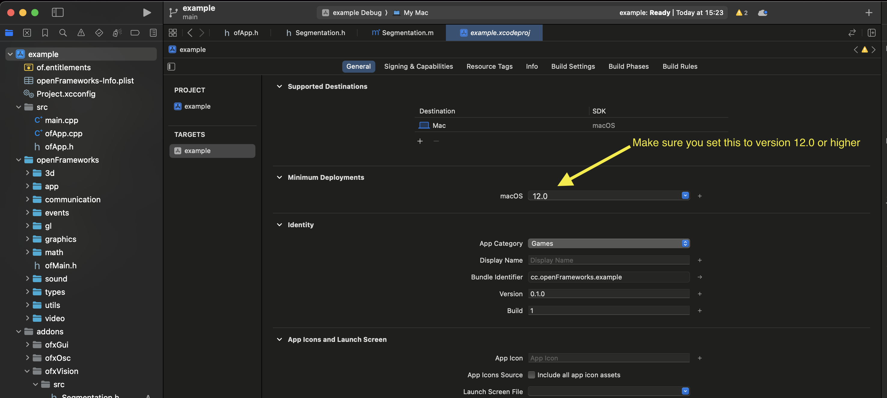

# ofxVision

### [openFrameworks](https://openframeworks.cc/) addon for using Apple's [Vision Framework](https://developer.apple.com/documentation/vision).

Inspired and adapted from [VisionOSC](https://github.com/LingDong-/VisionOSC/)

## Requirements

openFrameworks v0.12.0 or newer.
macOS 12+.

## How to Use

Just use with openFrameworks project generator to add to your project. Check the example on how to use. 

### Object detection
To use the object detection you need to download or train a model.
you can try with the models in the YOLO section at https://developer.apple.com/machine-learning/models/

## Important

Make sure that Xcode's Minimum Deployment Target it set to macos 12.0 or higher

